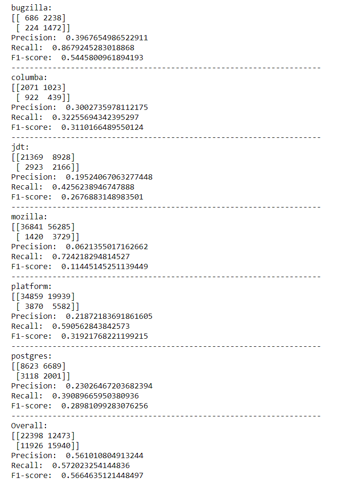

# Deep-Belief-Network-and-For-Software-Fault-Prediction-II
Used DBN model for training and Enseble of ANN, LogisticRegression, GaussianNB and RandomForestClassifier for classifying between defective and clean code

* Reconstruction error over epochs:

* Evaluation Scores:

